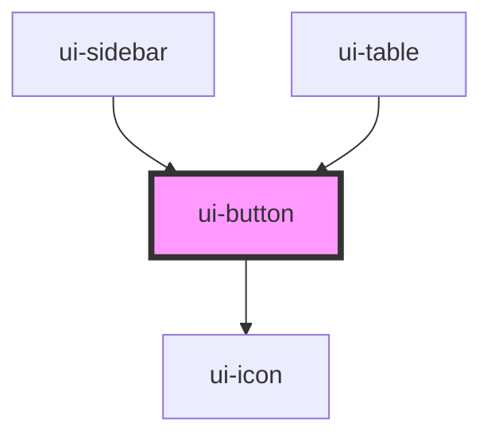

# ui-button

<!-- Auto Generated Below -->

## Overview

`ui-button` is a component for rendering buttons with different styles and icons.

## Properties

| Property   | Attribute   | Description                                                                                                               | Type                                                                                                                                                                                                   | Default     |
| ---------- | ----------- | ------------------------------------------------------------------------------------------------------------------------- | ------------------------------------------------------------------------------------------------------------------------------------------------------------------------------------------------------ | ----------- |
| `disabled` | `disabled`  | Whether the button is disabled. Defaults to false.                                                                        | `boolean`                                                                                                                                                                                              | `false`     |
| `iconName` | `icon-name` | The name of the icon to render inside the button on the left side. If provided, the button will render an `ui-icon` icon. | `"add" \| "arrow-left" \| "arrow-right" \| "close" \| "delete" \| "edit" \| "menu" \| "minus" \| "next-double-arrow" \| "notification" \| "previous-double-arrow" \| "search" \| "settings" \| "user"` | `undefined` |
| `type`     | `type`      | The type of the button. Can be 'button', 'submit', or 'reset'. Defaults to 'button'.                                      | `"button" \| "reset" \| "submit"`                                                                                                                                                                      | `'button'`  |
| `variant`  | `variant`   | The variant of the button. Can be 'primary', 'secondary', or 'tertiary'. Defaults to 'primary'.                           | `"primary" \| "secondary" \| "tertiary"`                                                                                                                                                               | `'primary'` |

## Dependencies

### Used by

 - [ui-sidebar](../ui-sidebar)
 - [ui-table](../ui-table)

### Depends on

- [ui-icon](../ui-icon)

### Graph

----------------------------------------------

*Built with [StencilJS](https://stenciljs.com/)*
