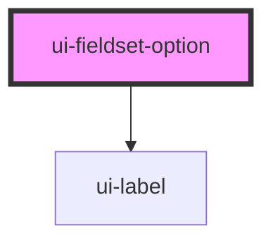

# ui-fieldset-option

<!-- Auto Generated Below -->

## Overview

`ui-fieldset-option` is a component for rendering options within a fieldset.
It can be used to create radio buttons or checkboxes with labels.

## Properties

| Property             | Attribute  | Description                                                           | Type                    | Default     |
| -------------------- | ---------- | --------------------------------------------------------------------- | ----------------------- | ----------- |
| `checked`            | `checked`  | Whether the input is checked by default.                              | `boolean`               | `undefined` |
| `label` _(required)_ | `label`    | The label text for the input.                                         | `string`                | `undefined` |
| `name` _(required)_  | `name`     | The name of the input, used to group radio buttons.                   | `string`                | `undefined` |
| `required`           | `required` |                                                                       | `boolean`               | `undefined` |
| `type`               | `type`     | The type of input, either 'radio' or 'checkbox'. Defaults to 'radio'. | `"checkbox" \| "radio"` | `'radio'`   |
| `value` _(required)_ | `value`    | The value of the input, which is submitted with the form.             | `string`                | `undefined` |

## Dependencies

### Depends on

- [ui-label](../ui-label)

### Graph

----------------------------------------------

*Built with [StencilJS](https://stenciljs.com/)*
