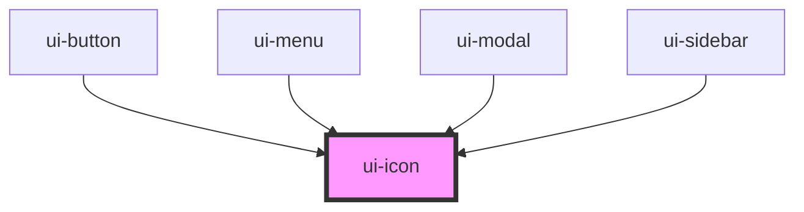

# ui-icon

<!-- Auto Generated Below -->

## Overview

`ui-icon` is a component for rendering icons.
It supports various icon names defined in the icons object.

## Properties

| Property            | Attribute | Description                     | Type                                                                                                                                                                                                   | Default     |
| ------------------- | --------- | ------------------------------- | ------------------------------------------------------------------------------------------------------------------------------------------------------------------------------------------------------ | ----------- |
| `name` _(required)_ | `name`    | The name of the icon to render. | `"add" \| "arrow-left" \| "arrow-right" \| "close" \| "delete" \| "edit" \| "menu" \| "minus" \| "next-double-arrow" \| "notification" \| "previous-double-arrow" \| "search" \| "settings" \| "user"` | `undefined` |

## Dependencies

### Used by

 - [ui-button](../ui-button)
 - [ui-menu](../ui-menu)
 - [ui-modal](../ui-modal)
 - [ui-sidebar](../ui-sidebar)

### Graph

----------------------------------------------

*Built with [StencilJS](https://stenciljs.com/)*
