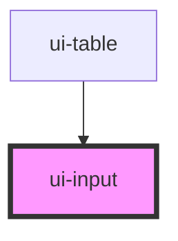

# ui-input

<!-- Auto Generated Below -->

## Properties

| Property       | Attribute      | Description                                | Type      | Default     |
| -------------- | -------------- | ------------------------------------------ | --------- | ----------- |
| `autocomplete` | `autocomplete` | Autocomplete attribute for the input field | `string`  | `undefined` |
| `disabled`     | `disabled`     | If the input is disabled                   | `boolean` | `undefined` |
| `fieldId`      | `field-id`     | The ID of the input field                  | `string`  | `undefined` |
| `name`         | `name`         | The name of the input field                | `string`  | `undefined` |
| `placeholder`  | `placeholder`  | Placeholder text for the input field       | `string`  | `undefined` |
| `readOnly`     | `read-only`    | If the input is read-only                  | `boolean` | `undefined` |
| `required`     | `required`     | If the input is required                   | `boolean` | `undefined` |
| `type`         | `type`         | The type of the input field                | `string`  | `'text'`    |
| `value`        | `value`        | The value of the input field               | `string`  | `undefined` |

## Dependencies

### Used by

 - [ui-table](../ui-table)

### Graph

----------------------------------------------

*Built with [StencilJS](https://stenciljs.com/)*
