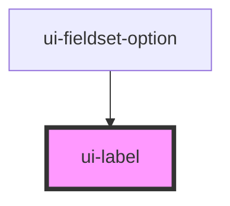

# ui-label

<!-- Auto Generated Below -->

## Overview

`ui-label` is a component for rendering label elements.
It can render as a paragraph, label, or legend element.

## Properties

| Property  | Attribute  | Description                                                                              | Type                         | Default     |
| --------- | ---------- | ---------------------------------------------------------------------------------------- | ---------------------------- | ----------- |
| `as`      | `as`       | The HTML element to render as. Can be 'p', 'label', or 'legend'.                         | `"label" \| "legend" \| "p"` | `'label'`   |
| `htmlFor` | `html-for` | The `for` attribute for the label element. This is only applicable when `as` is 'label'. | `string`                     | `undefined` |

## Dependencies

### Used by

 - [ui-fieldset-option](../ui-fieldset-option)

### Graph

----------------------------------------------

*Built with [StencilJS](https://stenciljs.com/)*
