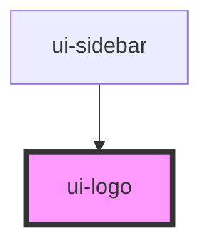

# ui-logo

<!-- Auto Generated Below -->

## Overview

`ui-logo` is a component for rendering a logo image.
It allows customization of the logo's width and height.

## Properties

| Property | Attribute | Description                                          | Type     | Default |
| -------- | --------- | ---------------------------------------------------- | -------- | ------- |
| `height` | `height`  | The height of the logo image. Default is 100 pixels. | `number` | `100`   |
| `width`  | `width`   | The width of the logo image. Default is 100 pixels.  | `number` | `100`   |

## Dependencies

### Used by

 - [ui-sidebar](../ui-sidebar)

### Graph

----------------------------------------------

*Built with [StencilJS](https://stenciljs.com/)*
