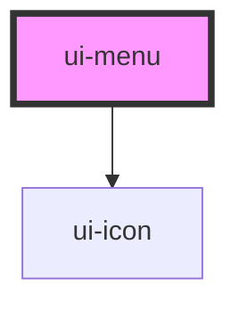

# ui-menu

<!-- Auto Generated Below -->

## Overview

`ui-menu` is a component for rendering a menu with items.
It supports positioning and dynamic data binding for menu items.

## Properties

| Property   | Attribute  | Description                                                                                                                                                  | Type                        | Default |
| ---------- | ---------- | ------------------------------------------------------------------------------------------------------------------------------------------------------------ | --------------------------- | ------- |
| `data`     | `data`     | The menu items to display in the menu. Each item should conform to the UIMenuItem interface.                                                                 | `UIMenuItem[]`              | `[]`    |
| `open`     | `open`     | Indicates whether the menu is open or closed.                                                                                                                | `boolean`                   | `false` |
| `position` | `position` | Position relative to the viewport where the menu should be displayed.  If not provided, the menu will be positioned automatically based on the host element. | `{ x: number; y: number; }` | `null`  |

## Events

| Event   | Description                            | Type                |
| ------- | -------------------------------------- | ------------------- |
| `close` | Event emitted when the menu is closed. | `CustomEvent<void>` |

## Dependencies

### Depends on

- [ui-icon](../ui-icon)

### Graph

----------------------------------------------

*Built with [StencilJS](https://stenciljs.com/)*
