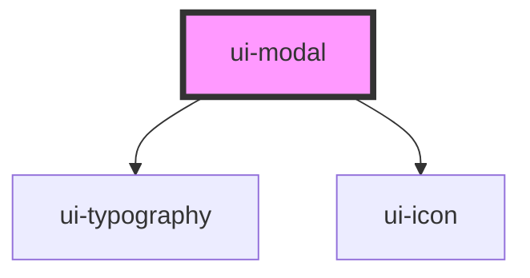

# ui-modal

<!-- Auto Generated Below -->

## Overview

`ui-modal` is a component for rendering a modal dialog.
It supports opening and closing the modal, and allows for custom header and footer content.

## Properties

| Property         | Attribute          | Description                                                                                                     | Type      | Default         |
| ---------------- | ------------------ | --------------------------------------------------------------------------------------------------------------- | --------- | --------------- |
| `footerSlotName` | `footer-slot-name` | The name of the slot for the footer content. This allows for custom footer content to be passed into the modal. | `string`  | `'footer-slot'` |
| `headerTitle`    | `header-title`     | The title of the modal header. This is displayed at the top of the modal.                                       | `string`  | `undefined`     |
| `open`           | `open`             | Indicates whether the modal is open or closed.                                                                  | `boolean` | `false`         |

## Events

| Event   | Description                             | Type                |
| ------- | --------------------------------------- | ------------------- |
| `close` | Event emitted when the modal is closed. | `CustomEvent<void>` |

## Methods

### `closeModal() => Promise<void>`

Closes the modal dialog.
This method is called to hide the modal when the `open` property is set to false.
It uses the native `close` method of the HTMLDialogElement.

#### Returns

Type: `Promise<void>`

### `showModal() => Promise<void>`

Opens the modal dialog.
This method is called to display the modal when the `open` property is set to true.
It uses the native `showModal` method of the HTMLDialogElement.

#### Returns

Type: `Promise<void>`

## Dependencies

### Depends on

- [ui-typography](../ui-typography)
- [ui-icon](../ui-icon)

### Graph

----------------------------------------------

*Built with [StencilJS](https://stenciljs.com/)*
