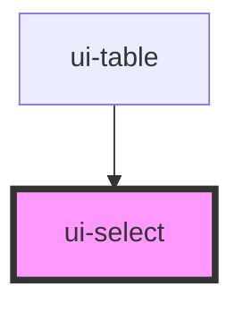

# ui-select

<!-- Auto Generated Below -->

## Overview

`ui-select` is a component for rendering a select dropdown.
It allows customization of the select element's ID and name.

## Properties

| Property  | Attribute  | Description                    | Type     | Default     |
| --------- | ---------- | ------------------------------ | -------- | ----------- |
| `fieldId` | `field-id` | The ID of the select element   | `string` | `undefined` |
| `name`    | `name`     | The name of the select element | `string` | `undefined` |

## Dependencies

### Used by

 - [ui-table](../ui-table)

### Graph

----------------------------------------------

*Built with [StencilJS](https://stenciljs.com/)*
