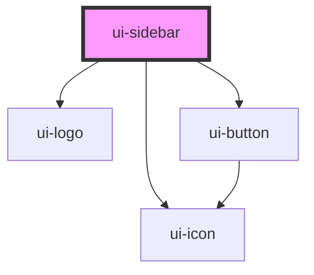

# ui-sidebar

<!-- Auto Generated Below -->

## Overview

`ui-sidebar` is a component for rendering a sidebar navigation.
It supports toggling open/closed state and displaying a list of items.

## Properties

| Property | Attribute | Description                                      | Type              | Default |
| -------- | --------- | ------------------------------------------------ | ----------------- | ------- |
| `items`  | `items`   | The items to display in the sidebar.             | `UISidebarItem[]` | `[]`    |
| `open`   | `open`    | Indicates whether the sidebar is open or closed. | `boolean`         | `false` |

## Dependencies

### Depends on

- [ui-icon](../ui-icon)
- [ui-logo](../ui-logo)
- [ui-button](../ui-button)

### Graph

----------------------------------------------

*Built with [StencilJS](https://stenciljs.com/)*
