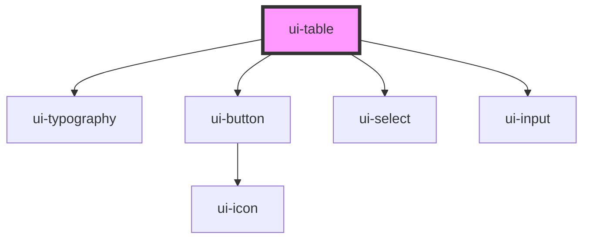

# ui-table

<!-- Auto Generated Below -->

## Overview

`ui-table` is a component for rendering a table with customizable columns and rows.
It supports various cell types including text, links, buttons, inputs, and selects.

## Properties

| Property       | Attribute       | Description                                                                                                                                                | Type              | Default  |
| -------------- | --------------- | ---------------------------------------------------------------------------------------------------------------------------------------------------------- | ----------------- | -------- |
| `columns`      | `columns`       | An array of column definitions for the table. Each column is defined by a label and an optional alignment. Alignement can be 'left', 'center', or 'right'. | `UITableColumn[]` | `[]`     |
| `maxHeight`    | `max-height`    | Maximum height of the table. This can be set to a specific value like '400px' or '100%'.                                                                   | `string`          | `'100%'` |
| `maxWidth`     | `max-width`     | Optional properties to control the table's appearance. These include maxWidth, maxHeight, and overflow styles.                                             | `string`          | `'100%'` |
| `overflow`     | `overflow`      | Overflow style for the table. Can be set to 'auto', 'scroll', or 'hidden'.                                                                                 | `string`          | `'auto'` |
| `rows`         | `rows`          | An array of row data for the table. Each row is an array of cells Each cell can by a text, link, button, input & select element.                           | `UITableRow[]`    | `[]`     |
| `stickyHeader` | `sticky-header` |                                                                                                                                                            | `boolean`         | `false`  |

## Dependencies

### Depends on

- [ui-typography](../ui-typography)
- [ui-button](../ui-button)
- [ui-select](../ui-select)
- [ui-input](../ui-input)

### Graph

----------------------------------------------

*Built with [StencilJS](https://stenciljs.com/)*
