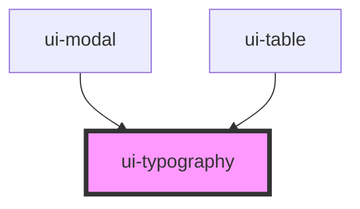

# ui-typography

<!-- Auto Generated Below -->

## Overview

`ui-typography` is a component for rendering typography elements.
It supports different variants such as headings and paragraphs.

## Properties

| Property  | Attribute | Description                                                                                     | Type                                                  | Default |
| --------- | --------- | ----------------------------------------------------------------------------------------------- | ----------------------------------------------------- | ------- |
| `variant` | `variant` | The variant of the typography element. Can be one of 'h1', 'h2', 'h3', 'h4', 'h5', 'h6' or 'p'. | `"h1" \| "h2" \| "h3" \| "h4" \| "h5" \| "h6" \| "p"` | `'h1'`  |

## Dependencies

### Used by

 - [ui-modal](../ui-modal)
 - [ui-table](../ui-table)

### Graph

----------------------------------------------

*Built with [StencilJS](https://stenciljs.com/)*
